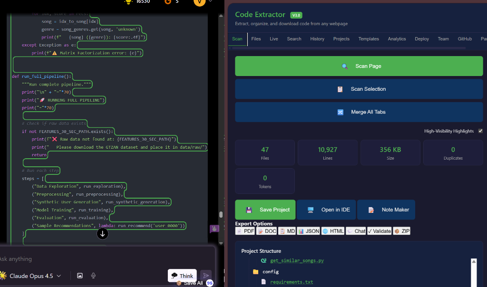
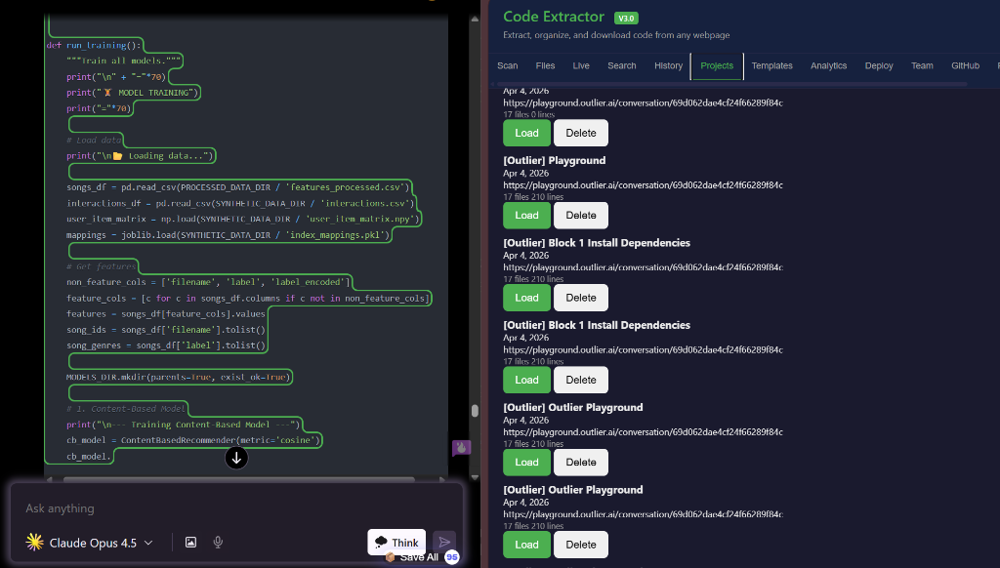

# Code Extractor & Project Builder V2.0

A Chrome extension that scans any AI chat webpage, extracts all code blocks, intelligently detects file names and folder structure, and downloads everything as a ready-to-open VS Code project ZIP.

## Screenshots


*Example of Code Extractor scanning Claude AI code blocks and displaying the project structure.*


*Example of Code Extractor managing saved projects extracted from Outlier.*

## V2.0 New Features

- **Live Scanning** — MutationObserver auto-detects new code blocks as AI streams responses, no re-scan needed
- **Multi-Tab Merging** — Combine projects extracted from multiple browser tabs into one unified project
- **Version History** — Track file changes over time with full diff viewer and rollback support
- **Universal Search** — Search across all projects, files, and code content with relevance scoring
- **Code Diff Viewer** — Visual side-by-side or unified diff comparison between file versions
- **Direct IDE Export** — Export projects to VS Code, Cursor, OpenCode, and Antigravity with workspace configs
- **GitHub Integration** — Push projects directly to GitHub repos or create gists with one click
- **Custom Templates** — Predefined project structures (Python Web, React, Node API, Data Science, Chrome Extension)
- **Code Validation** — Syntax checking for JavaScript, Python, HTML, CSS, JSON, YAML, SQL, Bash, and Markdown
- **Smart Deduplication** — Advanced duplicate detection with similarity scoring and conflict resolution

## V1.0 Core Features

- **One-Click Extraction** — Scan any page and get a complete project ZIP in seconds
- **Multi-Site Support** — Works on ChatGPT, Claude, Gemini, Outlier, Mistral, Poe, GitHub, Stack Overflow, and any website
- **Smart File Detection** — Automatically detects file names from headers, surrounding text, code comments, and content analysis
- **Tree Structure Parsing** — Detects ASCII folder trees (├── └──) and builds proper directory hierarchy
- **60+ Languages** — Identifies programming languages from HTML classes, file extensions, and code content
- **Duplicate Handling** — Intelligently handles updated files with keep-latest, keep-all, or merge strategies
- **Auto-Generated Files** — Optionally includes README.md, .gitignore, and dependency files (requirements.txt, package.json)
- **100% Local** — No servers, no accounts, no data leaves your browser
- **Project History** — Save and reload extracted projects from local storage

## Supported Sites

| Site | URL |
|------|-----|
| ChatGPT | chat.openai.com, chatgpt.com |
| Claude | claude.ai |
| Gemini | gemini.google.com |
| Outlier | app.outlier.ai, *.outlier.ai |
| Mistral | chat.mistral.ai |
| Poe | poe.com |
| GitHub | github.com |
| Stack Overflow | stackoverflow.com |
| Any Website | Generic fallback parser |

## Installation

### From Chrome Web Store (Coming Soon)

1. Visit the [Chrome Web Store listing](#)
2. Click "Add to Chrome"
3. Pin the extension to your toolbar

### Manual Installation (Developer Mode)

1. Download or clone this repository
2. Open Chrome and navigate to `chrome://extensions`
3. Enable "Developer mode" (toggle in top-right)
4. Click "Load unpacked"
5. Select the `code-extractor-extension` folder
6. The extension icon appears in your toolbar

## Usage

1. Navigate to any AI chat page with code blocks
2. Click the Code Extractor icon in your toolbar
3. Click "Scan This Page"
4. Review the detected project structure
5. Click "Download ZIP" to get your project
6. Extract and open in VS Code — done!

### Keyboard Shortcuts

- `Ctrl+Shift+E` / `Cmd+Shift+E` — Open Code Extractor
- `Ctrl+Shift+S` / `Cmd+Shift+S` — Scan current page
- `Ctrl+Shift+L` / `Cmd+Shift+L` — Toggle live scanning (V2.0)
- `Ctrl+Shift+F` / `Cmd+Shift+F` — Universal search (V2.0)

### Right-Click Menu

- Right-click anywhere on a page → "Scan Page for Code Blocks"
- Right-click selected text → "Scan Selected Code"
- Right-click anywhere on a page → "Toggle Live Scanning" (V2.0)

## Architecture

```
code-extractor-extension/
├── manifest.json          # Extension configuration (V3, v2.0.0)
├── background/            # Service worker (message routing, storage, downloads)
├── content/               # Content scripts (page scanning, live detection, DOM injection)
├── popup/                 # Popup UI (main extension interface)
├── sidepanel/             # Side panel UI (larger workspace view with V2.0 tabs)
├── core/                  # Business logic engine
│   ├── CodeScanner.js     # Main orchestrator
│   ├── CodeBlockExtractor.js
│   ├── FileNameDetector.js
│   ├── LanguageIdentifier.js
│   ├── TreeParser.js
│   ├── ProjectMapper.js
│   ├── DuplicateHandler.js
│   ├── ProjectAssembler.js
│   ├── LiveScanner.js          # V2.0: MutationObserver auto-detection
│   ├── IncrementalMerger.js    # V2.0: Merge new blocks with existing project
│   ├── ScanStateManager.js     # V2.0: Track scanning state and changes
│   ├── TabManager.js           # V2.0: Cross-tab discovery and merging
│   └── SmartDuplicateDetector.js # V2.0: Advanced similarity-based dedup
├── parsers/               # Site-specific DOM parsers
├── generators/            # Output generation (ZIP, README, dependencies, IDE export)
│   ├── ReadmeGenerator.js
│   ├── DependencyGenerator.js
│   ├── TreeVisualizer.js
│   ├── ZipGenerator.js
│   └── IDEExport.js            # V2.0: VS Code, Cursor, OpenCode, Antigravity
├── storage/               # Data persistence (IndexedDB V2, chrome.storage)
│   ├── IndexedDBHelper.js      # V2: Added version_history, templates, search_index stores
│   ├── FileStore.js
│   ├── ProjectStore.js
│   ├── SettingsStore.js
│   ├── StorageManager.js
│   ├── ExportImport.js
│   ├── UniversalSearch.js      # V2.0: Full-text search across all projects
│   └── VersionHistory.js       # V2.0: File version tracking with diff
├── ui/                    # Reusable UI components
│   ├── CodeHighlighter.js
│   ├── CodePreview.js
│   ├── FileEditor.js
│   ├── Modal.js
│   ├── ProgressBar.js
│   ├── SearchBar.js
│   ├── ThemeManager.js
│   ├── Toast.js
│   ├── TreeView.js
│   └── CodeDiffViewer.js       # V2.0: Visual diff rendering
├── utils/                 # Utility functions and constants
│   ├── constants.js            # V2: Updated message types, settings, DB config
│   ├── helpers.js
│   ├── domUtils.js
│   ├── regexPatterns.js
│   ├── languageMap.js
│   ├── validators.js
│   ├── errorHandler.js
│   ├── logger.js
│   ├── messageHandler.js
│   ├── GitHubIntegration.js    # V2.0: GitHub API wrapper (repos, push, gists, PRs)
│   ├── TemplateManager.js      # V2.0: Predefined project templates
│   └── CodeValidator.js        # V2.0: Multi-language syntax validation
├── styles/                # Global styles and themes
│   ├── base.css
│   ├── components.css
│   ├── popup.css
│   ├── sidepanel.css           # V2: Added styles for all new UI panels
│   ├── animations.css
│   ├── variables.css
│   └── themes/
├── libs/                  # Third-party libraries (JSZip, FileSaver)
└── assets/                # Icons and images
```

## Privacy

- **All data stays local** — No data is ever sent to external servers
- **No analytics or telemetry** — We don't track your usage
- **No accounts required** — Completely anonymous
- **Read-only page access** — We only read the page DOM, never modify content
- **Minimal permissions** — Only the permissions we actually need

## Development

### Project Structure

The extension uses vanilla JavaScript (ES6+) with no build step. Each module is a separate file loaded via the manifest's content script and HTML script tags.

### Adding a New Parser

1. Create a new file in `parsers/` (e.g., `MySiteParser.js`)
2. Extend `BaseParser` and implement required methods
3. Register the parser in `ParserFactory.js`
4. Add URL patterns to `utils/constants.js`

### Running Tests

1. Load the extension in Chrome (developer mode)
2. Navigate to `chrome-extension://[EXTENSION_ID]/tests/runner.html`
3. Click "Run All Tests"

## Contributing

1. Fork the repository
2. Create a feature branch (`git checkout -b feature/my-feature`)
3. Commit your changes (`git commit -m 'Add my feature'`)
4. Push to the branch (`git push origin feature/my-feature`)
5. Open a Pull Request

## License

MIT License — see [LICENSE](LICENSE) file for details.

## Changelog

See [CHANGELOG.md](CHANGELOG.md) for version history.

### V2.0.0 (2026)

- Added Live Scanning with MutationObserver auto-detection
- Added Multi-Tab Merging for cross-tab project combination
- Added Version History with change tracking and diff viewer
- Added Universal Search across all projects and files
- Added Code Diff Viewer with split/unified view modes
- Added Direct IDE Export (VS Code, Cursor, OpenCode, Antigravity)
- Added GitHub Integration (repo push, gist creation)
- Added Custom Templates (6 predefined project structures)
- Added Code Validation for 10+ languages
- Added Smart Duplicate Detection with similarity scoring
- Upgraded IndexedDB to V2 with new stores for version history, templates, and search index
- Added 20+ new message types for V2.0 features
- Added keyboard shortcuts for live scanning and universal search

### V1.0.0

- Initial release with core extraction functionality

---

*Built with ❤️ for developers who love AI-assisted coding*
